# OpenAGI

AI-powered coding assistant with direct filesystem access. No login required, just your API key.

<div align="center">
  
</div>

## What is this thing?

OpenAGI is a standalone coding assistant built from the TypeScript code extracted from the official Claude Code package by Anthropic. I've removed the authentication requirements. Now you can use all the features with just an Anthropic API key - no login process needed.

## Features

- **Direct File Operations**: Let AI edit your code while you grab another energy drink
- **Command Execution**: Run terminal stuff without switching windows (productivity hack!)
- **Smart Code Understanding**: It actually gets your spaghetti code somehow
- **Multi-Directory Support**: Jump around your project like a coding ninja
- **Cross-Platform**: Works wherever you do (Windows/Mac/Linux)

## Installation & Setup

### Option 1: Global Installation (The Easy Way)

```bash
npm install -g open-agi
```

Then run it from any directory:

```bash
openagi
```

### Option 2: Local Development (The Hacker Way)

1. Clone the repository
2. Set up your environment variables:
   ```bash
   # Copy the example file
   cp .env.example .env
   
   # Edit the .env file with your API key
   ANTHROPIC_API_KEY=sk-ant-your-api-key-here
   ```
3. Build the project:
   ```bash
   npm run build:no-types
   ```
4. Run the CLI:
   ```bash
   npm run cli
   # OR if using yarn
   yarn cli
   ```

## Usage

```bash
# Start OpenAGI in the current directory
openagi

# Start with a specific directory
openagi --dir=/path/to/project

# Run in print-only mode (non-interactive)
openagi -p "Generate a React component for a user profile"

# Enable debug mode
openagi -d
```

## Available Tools

This thing comes with some serious firepower:

- **Bash**: Shell commands go brrr
- **Glob**: Find files faster than you can say "regex"
- **Grep**: Search your codebase like a boss
- **LS**: List dirs because typing 'ls' is too much work
- **View**: Read files without opening them (mind blown)
- **Edit**: Make surgical code edits while you chill
- **Replace**: Nuke entire files when you're feeling dangerous
- **Notebook**: Jupyter notebook support because why not
- **Think**: Let AI plan stuff while you take credit
- **Memory**: It remembers things so you don't have to

## Environment Variables

Create a `.env` file with your API key:

```
ANTHROPIC_API_KEY=your_api_key_here
```

## Troubleshooting

### JSON Import Error on Node.js v20

If you see this error with "Unexpected token 'with'", Node.js is being Node.js again. Try:

```bash
node --experimental-json-modules $(which openagi)
```

Or just update to Node.js v21+ like a normal person.

### Missing ripgrep Error on Windows

If ripgrep is missing, install it globally:

```powershell
# Install with Chocolatey
choco install ripgrep

# OR install with Scoop
scoop install ripgrep
```

## License

MIT (feel free to do whatever, I'm not your boss)
